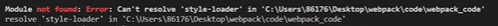
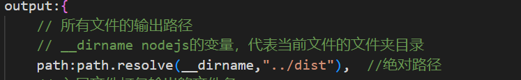

###基础
* 基本使用
  * 1. 资源目录
    * 
  * 2. 创建文件
    * count.js
      ```
      export default function count(x,y){
          return x-y;
      }```
    * sum.js
      *
      ```export default function sum(...args){
      return args.reduce((p,c)=>p+c,0)
      }```
    * main.js
      *
        ```
        import count from "./js/count"
        import sum from "./js/sum"

        console.log(count(1,2));
        console.log(sum(1,2,3,4));```
  * 3. 下载依赖
    * 打开终端(open in integrated terminal)
      * 初始化 npm init -y 后会出现package.json文件
    * 下载依赖
      * npm i-webpack webpack-cli -D
  * 4. 启用Webpack
    * 开发模式(回车后出现绿色的successfully即表示成功)
      *
        ```
        npx webpack ./src/main.js --mode=deveolment
        ```
      * 生产模式(同上)
        ```
        npx webpack ./src/main.js --mode=production
        ```
      * npx webpack:用来运行本地安装Webpack包的
      * ./src/main.js:指定Webpack从main.js文件开始打包，不但会打包main.js，还会将其依赖也一起打包进来
      * --mode=xxx(development/production):制定环境/模式
  * 5. 观察输出文件
    * 默认Webpack会将打包的文件输出到第三天目录下，查看dist目录下的文件会发现，代码比src目录下的文件简洁了许多
      *
        ```
        (()=>{"use strict";console.log(void 0),console.log([1,2,3,4].reduce(((o,e)=>o+e),0))})();
        ```

* 基本配置
  * 5大核心概念
    * ```
      const path=require('path')  //nodejs核心模块，专门用来处理路径问题

      module.exports={
      // 入口(entry,只是Webpack从哪个文件开始打包)
      entry:"./src/main.js", //相对路径
      // 输出(output,只是Webpack打包的文件输出到哪里去，并如何命名等)
      output:{
        // 文件的输出路径
        // __dirname nodejs的变量，代表当前文件的文件夹目录
        path:path.resolve(__dirname,"dist"),  //绝对路径
        // 文件名
        filename:"main.js"
        },
      // 加载器(loader,webpack本身只能处理js、json等资源，其他资源需要借助loader，Webpack才能解析)
        // 此处什么资源都没有添加，在终端运行npx webpack指令时会报错，无法打包，没有内容的配置注释掉就可以打包成功了
        // module:{
        //     rules:{
        //         // loader的配置
        //     },
        // },
        // // 插件
        // plugins:{
        //     //plugins的配置
        // },
      // 模式(mode,主要是两种模式，开发:development;生产:production)
        mode:"development"
      }
      ```
    * 运行指令 npx webpack 后在浏览器控制台上查看

* 开发模式介绍
  * 开发模式就是我们开发代码时使用的模式，这个模式下我们主要做两件事：
  * 1. 编译代码，使浏览器能识别运行
    * 开发时有很多资源，如字体图标、图片资源、html资源、css资源等，webpack默认无法识别处理这些资源，所以我们需要加载配置来编译这些资源
  * 2.代码质量检查，梳理代码规范
    * 提前检查代码的一些隐患，让代码运行时能更加顺畅
    * 提前检查代码的规范和格式，统一团队编码风格，让代码更简洁、优雅美观
* 处理样式资源
  * 介绍：webpack本身无法识别处理样式资源，所以需要加载器loader来帮助webpack解析样式资源。loader需要去官方文档中寻找与之相对应的loader，并使用
  * 如何处理css资源？
    * 1. 下载包/配置 npm i css-loader/style-loader -D(主要下载两个loader，style和css)
      * 当没有下载包/配置时，直接运行指令npx webpack会报错
    * 2. 然后把loader引用到webpack配置中
      * main.js
        ```
        import "./css/index.css"
        ```
      * webpack.config.js rules中引入
        ```
        {
          test: /\.css$/i,  //只检测.css文件
          use: [  //执行顺序，从右到左(从下到上)
            "style-loader", //将js中的css通过创建style标签添加到html文件中，使其生效
            "css-loader" //将css资源编译成commonjs的模块到js中
          ],
        },
        ```
      * 运行webpack指令时出现如下的报错，意思是需要的配置没有下载，在官网找到之后下载最后再运行webpack指令即可
        * 
      * 打包后会发现css被打包到./dist.main.js里面了，此时打开index.html文件打开浏览器->控制台，会发现会创建动态的css代码
        * 如果此时在index.html中添加一个容器，在浏览器中会显示
    *  功能介绍
      * css-loader:负责将css文件编译成Webpack能识别的模块
      * style-loader:会动态创建一个style标签，里面放置Webpack中css模块内容
      * 此时样式就会以style标签的形式在页面/浏览器上显示/生效

* 处理less资源
  * 和处理css资源的方式一样，首先安装less和less-loader npm install less less-loader --save-dev
  * 其次，将对应的loader添加到webpack配置中，并把创建的文件导入到入口文件中(main.js)
  * 再次，输入运行webpack指令
  * 最后，在控制台中查看，会和样式一样形成动态的css代码，也会在页面中显示

* 处理Sass和Scss资源
  * 处理方式与处理css和less资源的方式一样，首先安装npm i sass-loader sass -D和npm i scss-loader scss -D
  * 其次，将相对应的loader添加到webpack配置中，并把创建的文件导入到入口文件中(main.js)
  * 再次，输入运行webpack指令
  * 最后，在浏览器中查看形成功能动态的css代码即成功打包
  * ***注：此处，在sass文件夹中创建了sass文件和scss文件，注意区分不同的写法***
    * .scss
    ```
    .box4{
      width:100px;
      height:100px;
      background: darkgreen;
    }
    ```
    * .sass
    ```
    .box3
      width:100px
      height:100px
      background:#ccf
    ```

* 处理stylus资源
  * 处理方式与处理css和less资源的方式一样，首先安装npm i stylus-loader -D
  * 其次，将相对应的loader添加到webpack配置中，并把创建的文件导入到入口文件中(main.js)
  * 再次，输入运行webpack指令
  * 最后，在浏览器中查看形成功能动态的css代码即成功打包
    * ***注：stylus文件的写法与sass文件相似，不用加大括号和分号，甚至是冒号***

* 处理图片资源
  * 1. 与处理样式资源不同，不需要安装loader
  * 2. 将图片分别插入到stylus、css、less文件中，此时会发现文件已经被打包好了，三个图片资源在dist目录中
    * 图片大小更小的图片会转换成base64，转换成base64格式就是把图片转换成字符串的形式，优势是减少图片请求数量，减小服务器压力
    * 但问题是转换后图片大小会变大，如原先图片大，转换后的图片会更大，所以小图片会转换成base64
  * 3.激活配置
    * test，添加图片格式的正则  /\.(png|je?g|gif|svg)/
    * type，设置type为asset(此操作相当于使用了url-loader，能够处理图片资源)
    * parser，// 小于10kb的图片转base64  // 优点：减少请求数量 缺点：体积会变大
  * 4. 打包(就是执行webpack指令)，打包后会发现dist目录里只有两个图片，没有的那个被转换为base64了
    * 打包前，要把之前存进dist目录的三张图片删掉，再重新打包才能看到效果
    * 
    * 因为大的图片没有转换，需要额外通过请求得到图片

* 修改输出资源的名称和路径
  * 配置：
    * ```
      generator: {
          // 将图片文件输出到static/images目录中
          // 将图片文件命名 [hash:10][ext][query]
          // [hash:10]: hash值取10位
          // [ext]: 使用之前的文件扩展名
          // [query]: 添加之前的query参数，可写可不写
          filename: "static/images/[hash:10][ext][query]",
        },
      ```
  * 打包，运行webpack指令(图片会在images文件夹中，js文件会在js文件夹中)
    * ***注意：需要将上次打包生成的文件(dist目录)清空/删除，再重新打包才有效果***

* 自动清空上次打包的内容
  * 在输出(output)中添加配置即可
    * ```
      // 自动清空上次打包的内容
      // 原理：在打包前，将path整个目录清空，再进行打包
      clean:true
      ```
  * 最后重新打包，运行webpack指令(即使修改文件夹名和资源文件名，打包后乱七八糟的都会被清空，恢复正常的状态)

* 处理字体图标资源
  * 下载字体图标文件
    * 1. 打开阿里巴巴矢量图标库
    * 2. 选择想要的图标添加到购物车，统一下载到本地
  * 添加字体图标资源
    * src/fonts/iconfont.ttf
    * src/fonts/iconfont.woff
    * src/fonts/iconfont.woff2
    * src/css/iconfont.css 导入到入口文件中
  * 配置：
    *
      ```
       //type: 'asset/resource'相当于file-loader，只会将文件转化成Webpack能识别的资源，不会让文件被转换成base64的格式
       //type: "asset" 相当于url-loader，将文件转化成Webpack能识别的资源，同时小于某个大小的资源会处理成data URI形式
       type: 'asset/resource',
      ```
  * 在html文件中写入span标签，并使用字体图标格式
  * 最后打包，运行webpack指令，到浏览器刷新后，即可看见图标

* 处理其他资源，开发中还存在一些其他资源，如音视频等
  * 配置：只需在处理字体图标资源的基础上添加其他资源的文件类型，统一处理即可
  * 在这里因为没有资源且不想另做几个音视频就没写，需要时添加后，打包，运行webpack指令，再打开index.html页面即可查看效果
    * 添加的其他资源的文件会打包到static/media中

* 处理js资源
  * Eslint
    * 介绍：
      * 可组装的JavaScript和JSX检查工具，意思就是：它是用来检测js和jsx语法的工具，可以配置各种功能
      * 是专门用来处理JavaScript或JSX的，js就是开发的代码；jsx可以编译/检查react语法
    * 1. 配置文件
      * 配置文件有很多种写法：区别在于配置各式不一样
        * .eslintrc.*：新建文件，位于项目根目录
          * .eslintrc       直接写
          * .eslintrc.js    需要使用commonjs模块语法暴露一个对象，这个更好写注释，也符合写代码的习惯
          * .eslintrc.json  需要符合json的格式
        * package.json中eslintConfig：不需要创建文件，在原有文件基础上写，ESLint会查找和自动读取它们，所以以上配置文件只需要有一个即可
    * 2. 具体配置(以.eslintrc.js配置文件为例)
      *
        ```
        module.exports = {
          // 解析选项
          parserOptions: {},
          // 具体检查规则
          rules: {},
          // 继承其他规则
          extends: [],
          // ...
          // 其他规则详见：https://eslint.bootcss.com/docs/user-guide/configuring
        };
        ```
        * parserOptions解析选项
          ```
          parserOptions: {
            ecmaVersion: 6, //ES语法版本要选好
            sourceType: "module", //ES模块化
            ecmaFeatures: { //ES 他特性
            jsx: true //如果是React项目，就需要开启jsx语法
            }
          }
          ```
        * rules具体规则(更多规则详见官网)
          ```
          rules: {
            semi: "error", // 禁止使用分号
            'array-callback-return': 'warn', // 强制数组方法的回调函数中有 return 语句，否则警告
            'default-case': [
            'warn', // 要求 switch 语句中有 default 分支，否则警告
            { commentPattern: '^no default$' } // 允许在最后注释 no default, 就不会有警告了
            ],
            eqeqeq: [
            'warn', // 强制使用 === 和 !==，否则警告
            'smart' // https://eslint.bootcss.com/docs/rules/eqeqeq#smart 除了少数情况下不会有警告
            ],
          }
          ```
          * off或0-关闭规则
          * warn或1-开启规则，使用警告级别的错误：warn(不会导致程序退出)
          * error或2-开启规则，使用错误级别的错误：error(当被触发的时候，程序会退出)
        * extend是继承
          * 开发中一点一点写rules规则会很闹心，所以可以继承现有的规则，有名的规则有：
            * Eslint 官方的规则：eslint:recommended
            * Vue Cli 官方的规则：plugin:vue/essential
            * React Cli 官方的规则：react-app
          * 例如在React项目中，可以这样写配置
            *
              ```
              module.exports = {
                extends: ["react-app"],
                rules: {
                // 我们的规则会覆盖掉react-app的规则
                // 所以想要修改规则直接改就是了
                eqeqeq: ["warn", "smart"],
                },
              };
              ```
    * 3. 在Webpack中使用
      * 下载包 npm install eslint eslint-webpack-plugin --save-dev
      * 定义ESLint配置文件，创建.eslintrc.js文件，直接将代码复制到文件中
        *
          ```
          module.exports = {
            // 继承 Eslint 规则
            extends: ["eslint:recommended"],
            env: {
            node: true, // 启用node中全局变量
            browser: true, // 启用浏览器中全局变量
            },
            parserOptions: {
            ecmaVersion: 6,  //es6
            sourceType: "module",  //es module
            },
            rules: {
            "no-var": 2, // 不能使用 var 定义变量
            },
          };
          ```
      * 添加配置
        * const ESLintWebpackPlugin = require("eslint-webpack-plugin");
        * ```new ESLintWebpackPlugin({
          // 指定检查文件的根目录
          context: path.resolve(__dirname, "src"),
          })```
      * 打包，运行webpack指令
  * Babel
    * JavaScript编译器，主要用于将ES6愈发编写的代码转换为向后兼容的JavaScript愈发啊，以便能够运行在当前和旧版本的浏览器或其他环境中
    * 配置文件：
      * babel.config.*：新建文件，位于项目根目录
        * babel.config.js
        * babel.config.json
      * .babelrc.*：新建文件，位于项目根目录
        * .babelrc
        * .babelrc.js
        * .babelrc.json
      * package.json 中 babel：不需要创建文件，在原有文件基础上写
      * Babel会查找和自动读取它们，所以以上配置文件只需存在一个即可
    * 具体配置(以babel.config.js配置文件为例)
      * ```module.exports = {// 预设 presets: [],};```
        * presets预设，简单理解就是一组Babel插件，扩展Babel功能；想用哪个就加在哪个预设即可，可以加载一个，也可以是多个
          * @babel/preset-env: 一个智能预设，允许您使用最新的JavaScript。
          * @babel/preset-react：一个用来编译React jsx语法的预设
          * @babel/preset-typescript：一个用来编译TypeScript语法的预设
    * 在webpack中使用
      * 下载包：npm i babel-loader @babel/core @babel/preset-env -D
      * 创建Babel配置文件  babel.config.js
        * ```module.exports = {presets: ["@babel/preset-env"], };```
      * 配置 webpack.config.js
        * ```{test: /\.js$/, exclude: /node_modules/, // 排除node_modules代码不编译 loader: "babel-loader", },```
      * 打包，运行指令后，打开打包后的dist/static/js/main.js问津查看，会发现箭头函数等ES6语法已经转换了

* 处理Html资源
  * 安装包 npm install --save-dev html-webpack-plugin
  * 添加插件到webpack配置
    * const HtmlWebpackPlugin = require('html-webpack-plugin')
    * plugins: [new HtmlWebpackPlugin()]
  * 打包，运行指令后，因为把html资源也打爆了，dist目录中会出现html资源。虽然引入了main.js资源，但是原文件资源的(dom)资源没有被引入
    * 模板：以public/index.html文件模板，创建新的html文件
    ```template:path.resolve(__dirname,'public/index.html')```
    * 新的html文件特点，1.（dom）结构和原来一致  2.自动引入打包输出的资源

* 开发服务器&自动化
  * 每次写完代码后都需要手动输入指令打包，才能编译代码，从操作可以使其自动化
  * 下载包  npm i webpack-dev-server -D
  * 配置
    * ```
      // 开发服务器：不会输出资源，是在内存中编译打包的
      devServer: {
        host: "localhost", // 启动服务器域名
        port: "3000", // 启动服务器端口号
        open: true, // 是否自动打开浏览器
      },
      ```
  * 运行指令  npx webpack serve
    * 当开始使用开发服务器时，所有的代码都会在内存中编译打包，不会输出到dist目录下

* 生产模式介绍
  * 生产模式是开发完成代码后，我们需要得到代码将来部署上线。这个模式下主要对代码进行优化，让其运行性能更好
  * 优化主要从两个角度出发：
    * 优化代码运行性能
    * 优化代码打包速度
  * 生产模式准备
    * 分别准备两个配置文件来放不同的配置
      * webpack.dev.js(开发模式配置文件)
      * webpack.prod.js(生产模式配置文件)
    * 修改webpack.dev.js，因为文件目录有变化了，所以所有绝对路径需要回退一层目录才能找到对应的文件
      * 
      * 
      * 运行开发模式下的指令  npx webpack serve --config ./config/webpack.dev.js
    * 修改webpack.prod.js
      * 
      * 注销/删除devServer
      * 运行生产模式的指令  npx webpack --config ./config/webpack.prod.js
    * 配置运行指令，为了方便运行不同模式的指令，我们降脂灵定义在package.json中的scripts里面
      * ```
        "scripts": {
          "start":"npx run dev",
          "dev": "webpack serve --config ./config/webpack.dev.js",
          "build":"webpack --config ./config/webpack.prod.js"
        }
        ```
      * 启动指令
        * 开发模式：npm start 或 npm run dev
        * 生产模式：npm run build
  * Css处理
    * 提取Css成单独文件(Css文件目前被打包到js文件中，当js文件加载时，会创建一个style标签来生成样式。 这样对于网站来说，会出现闪屏现象，用户体验不好，
      * 所以应该提取单独的Css文件，通过link标签加载性能才好)
      * 下载包  npm install --save-dev mini-css-extract-plugin
      * 配置 webpack.prod.js
        * 添加插件到webpack配置中
          * const MiniCssExtractPlugin = require("mini-css-extract-plugin");
          * 加载器(loader)中所有style-loader全部换成MiniCssExtractPlugin.loader
          * ```
            new MiniCssExtractPlugin({
            // 定义输出文件名和目录
            filename: "static/css/main.css",
            })```
      * 打包(npm run build)后刷新页面，就不会出现卡顿、闪屏的现象
    * Css兼容性处理
      * 下载包  npm i postcss-loader postcss postcss-preset-env -D
      * 配置  webpack.prod.js
        * 加载器(loader)中每个css-loader后添加{loader: "postcss-loader", options: { postcssOptions: { plugins: ["postcss-preset-env",], } }, },
          * 这能解决大多数样式兼容性问题
      * 控制兼容性
        * 在package.json文件中添加browserslist来控制样式的兼容性
        * //市面上所有浏览器最新的两个版本；覆盖99%的浏览器，冷门的就不兼容了；死了的版本不要
        * ```"last 2 version","> 1%","not dead"```
      * 运行指令  npm run build
      * 合并配置 webpack.prod.js
        * 创建构造函数 function getStyleloader(){}，把css-loader的内容添加进去，就可以在加载器中简便的书写代码了
          * ```use: getStyleloader(),```
        * 并传入一个参数pre，有需要不同的loader，就传参，然后再添加；下面的less、sass、stylus也就可以简便的书写了
          * eg：```use: getStyleloader('less-loader'),```
    * Css压缩
      * 下载包 npm install css-minimizer-webpack-plugin --save-dev(在官方文档中找，plugin->CssMinimizerWebpackPlugin)
      * 配置 webpack.prod.js
        * 引入插件 const CssMinimizerPlugin = require("css-minimizer-webpack-plugin");
        * 在plugin中引入调用 new CssMinimizerPlugin()
      * 打包后，在dist/static/css/main.css中可以看到代码被压缩成了一行
  * html压缩，默认在生产模式下就已开启，查看dist/static/js/main.js和dist/index.html即可发现两个文件已经被压缩，不需要额外进行配置


###
* 不管你在模式中创建了那些文件js也好，css也罢，都要导入到入口文件中，才能够被打包到一个指定区域的文件中，然后打包好了，再到public 的html 中去引入，才能被浏览器解析
* 想要webpack打包资源，必须引入该资源，且必须引入并使用，没有使用的资源或者变量，不会被打包
* 进行性能优化，把小图片转化成base64，减轻服务器压力
* 被转为base64的好像不能出现在images中：base64转换以字符串方式在浏览器渲染
* rules: {"no-var": 2, // 不能使用 var 定义变量} 在VSCode中安装ESLint插件，插件会帮助检查代码中有无问题，有没有按照ESLint规则做的，写错时会报错
* 需要ESLint插件检查的文件只在src目录中，但插件会无差别检查，导致查看dist目录时，全是报错，此时创建.eslintignore文件，把需要忽略掉，不需要插件检查的目录写上即可
* 我们用的高级语法，浏览器是运行不了的，babel的作用就是将我们高级的语法编译成浏览器能识别的语法。
* defer:解析是同步的，不会影响dom树，执行在dom树渲染完之后
* 新的html文件特点，1.（dom）结构和原来一致  2.自动引入打包输出的资源
* 开发模式在内存中编译，不会输出
* 生产模式不需要devServer，它只需要发包文件输出即可
